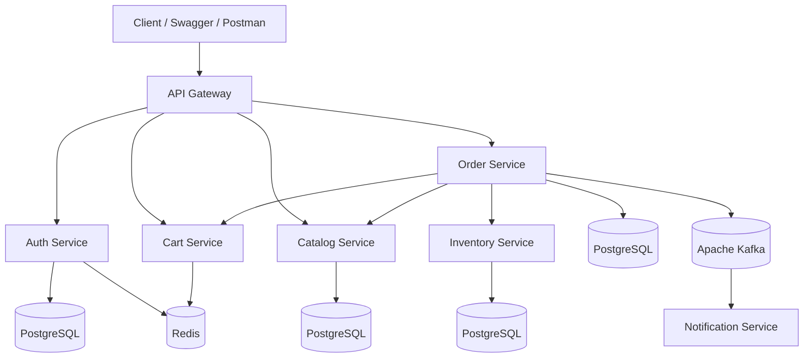

# CloudStore

CloudStore is a cloud-native e-commerce backend built with Java and Spring Boot.

The project represents a production-style distributed system to explore microservices architecture, event-driven communication, session management, container orchestration, infrastructure as code, observability, and automated testing.

The application provides user authentication, product management, session-scoped shopping carts, inventory management, checkout, order history, and asynchronous order notifications.

## Architecture

CloudStore follows a microservice architecture with synchronous REST communication for request/response operations and asynchronous Kafka events for domain events.



## Services

### API Gateway

Provides a single entry point for external requests and routes traffic to the appropriate backend service.

Responsibilities:

- request routing
- authentication validation
- centralized API entry point
- service isolation

### Auth Service

Responsible for user identity and session management.

Features:

- user registration
- secure password hashing
- login
- Redis-backed user sessions
- session expiration
- brute-force protection
- optional password reset

Passwords are never stored in plain text.

After a successful login, the API returns an opaque session identifier:

```json
{
  "sessionId": "0c60e6be-1243-4cb8-88ad-48bf69e22434"
}
```

Session information is stored in Redis with a configurable TTL.

### Catalog Service

Responsible for product information.

Example product:

```json
{
  "id": "2411",
  "title": "Nail gun",
  "available": 8,
  "price": 23.95
}
```

Product information is stored in PostgreSQL and exposed through a REST API.

### Inventory Service

Responsible for product availability and stock reservations.

Inventory operations are atomic to prevent multiple users from purchasing the same remaining stock concurrently.

During checkout, the service verifies that the requested quantity is still available before reserving it.

### Cart Service

Provides a session-scoped shopping cart backed by Redis.

Cart lifetime is associated with the authenticated user session. When the session expires, the corresponding cart also expires automatically.

Supported operations include:

- add product
- display cart
- update quantity
- remove product
- calculate subtotal
- clear cart after successful checkout

Example response:

```json
{
  "items": [
    {
      "position": 1,
      "productId": "2411",
      "title": "Nail gun",
      "quantity": 2,
      "price": 23.95
    }
  ],
  "subtotal": 47.90
}
```

### Order Service

Responsible for the complete checkout lifecycle.

During checkout the service:

1. Reads the current cart.
2. Retrieves the latest product prices.
3. Recalculates the order total.
4. Verifies product availability.
5. Reserves inventory.
6. Creates the order.
7. Clears the shopping cart.
8. Publishes an `OrderConfirmed` event.

Orders support the following statuses:

```text
CREATED
CONFIRMED
CANCELLED
```

The service also provides order history and optional order cancellation.

### Notification Service

Consumes order events from Apache Kafka.

For a confirmed order it processes an `OrderConfirmed` event and generates a confirmation notification.

The service is intentionally asynchronous so notification processing does not increase checkout latency.

## Event-Driven Communication

Apache Kafka is used for asynchronous domain events.

Example `OrderConfirmed` event:

```json
{
  "eventId": "2d911781-c9fe-42bd-a50a-b390f9731126",
  "eventType": "ORDER_CONFIRMED",
  "orderId": "ORD-10042",
  "userId": "USR-42",
  "total": 147.90,
  "createdAt": "2026-10-18T14:22:31Z"
}
```

## Transactional Outbox

CloudStore uses the Transactional Outbox pattern to reliably publish domain events.

Order data and an outbox event are saved within the same PostgreSQL transaction.

```text
Order Transaction

Order
  +
Order Items
  +
Outbox Event

        |
      COMMIT
        |
        v
Outbox Publisher
        |
        v
      Kafka
```

This prevents an order from being successfully stored while the corresponding Kafka event is lost.

## REST API

### Authentication

```http
POST /api/auth/register
POST /api/auth/login
POST /api/auth/password-reset
```

Registration request:

```json
{
  "email": "user@example.com",
  "password": "strong-password"
}
```

Login request:

```json
{
  "email": "user@example.com",
  "password": "strong-password"
}
```

### Products

```http
GET /api/products
GET /api/products/{id}
```

### Cart

```http
POST   /api/cart/items
GET    /api/cart
PATCH  /api/cart/items/{position}
DELETE /api/cart/items/{position}
```

Add product:

```json
{
  "id": "363",
  "quantity": 2
}
```

Modify cart item:

```json
{
  "quantity": 3
}
```

### Orders

```http
POST /api/orders/checkout
GET  /api/orders
POST /api/orders/{orderId}/cancel
```

Example order:

```json
{
  "id": "ORD-10042",
  "createdAt": "2026-10-18T14:22:31Z",
  "total": 147.90,
  "status": "CONFIRMED"
}
```

## Technology Stack

### Backend

- Java 21
- Spring Boot
- Spring Security
- Spring Data JPA
- Spring Cloud Gateway
- Maven
- Hibernate
- Flyway

### Data

- PostgreSQL
- Redis

### Messaging

- Apache Kafka

### Testing

- JUnit 5
- Mockito
- RestAssured
- Testcontainers

### Infrastructure

- Docker
- Docker Compose
- Kubernetes
- Helm
- Terraform

### CI/CD

- GitHub Actions
- Docker image build and publishing
- automated unit and integration tests

### Observability

- Spring Boot Actuator
- Micrometer
- Prometheus
- Grafana
- OpenTelemetry
- Jaeger

## Security

CloudStore follows several basic security practices:

- passwords are hashed using a strong adaptive hashing algorithm
- passwords are never stored or logged in plain text
- session identifiers are generated using cryptographically secure random identifiers
- sessions are stored in Redis with expiration
- login attempts can be rate-limited using Redis
- application secrets are provided using environment variables or Kubernetes Secrets
- internal services are not exposed directly outside the cluster

## Session Management

Redis is used for server-side session management.

Example:

```text
session:{sessionId}
TTL: 30 minutes

cart:{sessionId}
TTL: 30 minutes
```

Once the session expires, the user's cart automatically becomes unavailable and a new session starts with an empty cart.

## Inventory Consistency

Inventory updates are performed atomically.

Conceptually:

```sql
UPDATE inventory
SET available = available - :quantity
WHERE product_id = :productId
  AND available >= :quantity;
```

If no row is updated, the requested quantity is no longer available and checkout fails.

This prevents overselling when multiple customers attempt to purchase the same product concurrently.

## Local Development

The complete infrastructure can be started using Docker Compose.

```bash
docker compose up -d
```

The local environment includes:

- PostgreSQL
- Redis
- Kafka
- all application services

After startup, API documentation is available through Swagger/OpenAPI.

## Kubernetes

Each application service is deployed as an independent Kubernetes workload.

The deployment includes:

- Deployments
- Services
- ConfigMaps
- Secrets
- liveness probes
- readiness probes
- CPU/memory resource configuration

Helm is used to package and deploy the complete application.

Example:

```bash
helm install cloudstore ./infra/helm/cloudstore
```

For local Kubernetes development, the project can be deployed to `kind` or `minikube`.

## Infrastructure as Code

Terraform is used to describe cloud infrastructure declaratively.

The infrastructure layer may provision:

- networking
- Kubernetes cluster
- PostgreSQL
- Redis
- application infrastructure

```bash
terraform init
terraform plan
terraform apply
```

Infrastructure can be removed after testing with:

```bash
terraform destroy
```

## Observability

Application metrics are exposed through Spring Boot Actuator and Micrometer.

Prometheus collects application metrics and Grafana is used for visualization.

Distributed tracing can be performed using OpenTelemetry and Jaeger.

This makes it possible to trace requests across services such as:

```text
API Gateway
    ↓
Order Service
    ↓
Inventory Service
    ↓
PostgreSQL
```

## Testing Strategy

The project contains several levels of automated testing.

### Unit Tests

Business logic is tested using JUnit and Mockito.

### Integration Tests

Testcontainers starts real infrastructure dependencies during integration tests, including:

- PostgreSQL
- Redis
- Kafka

### API Tests

REST endpoints are validated using RestAssured.

### Concurrency Tests

Inventory tests verify that concurrent checkout requests cannot oversell products.

## Repository Structure

```text
cloudstore/
│
├── services/
│   ├── api-gateway/
│   ├── auth-service/
│   ├── catalog-service/
│   ├── inventory-service/
│   ├── cart-service/
│   ├── order-service/
│   └── notification-service/
│
├── infra/
│   ├── docker/
│   ├── kubernetes/
│   ├── helm/
│   └── terraform/
│
├── monitoring/
│   ├── prometheus/
│   └── grafana/
│
├── docs/
│   ├── architecture/
│   └── adr/
│
├── postman/
│
├── docker-compose.yml
└── README.md
```

## Development Roadmap

- [ ] Project and infrastructure bootstrap
- [ ] API Gateway
- [ ] User registration
- [ ] Authentication and Redis sessions
- [ ] Login brute-force protection
- [ ] Product catalog
- [ ] Inventory management
- [ ] Redis shopping cart
- [ ] Cart modification
- [ ] Checkout
- [ ] Order history
- [ ] Order cancellation
- [ ] Kafka integration
- [ ] Notification service
- [ ] Transactional Outbox
- [ ] Unit tests
- [ ] Integration tests with Testcontainers
- [ ] Docker images
- [ ] Kubernetes deployment
- [ ] Helm charts
- [ ] Terraform infrastructure
- [ ] Prometheus and Grafana monitoring
- [ ] OpenTelemetry distributed tracing
- [ ] CI/CD pipeline
